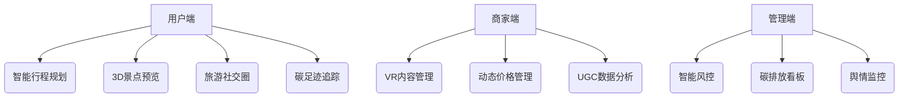
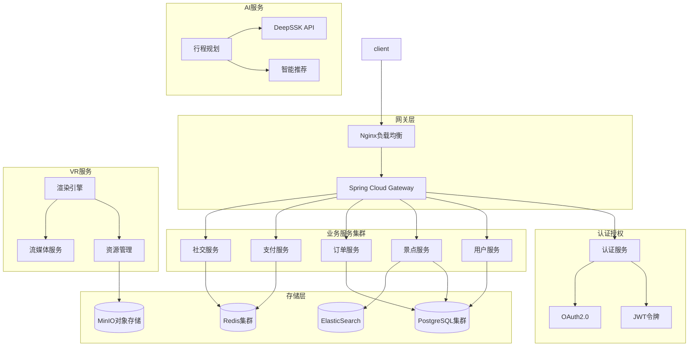

以下是一份完整的旅游网站毕业设计方案，涵盖需求分析、技术实现、功能模块和设计亮点，适合作为计算机科学、软件工程或数字媒体相关专业的毕业设计选题：

---

# **"游界"智能旅游平台毕业设计方案**

## **一、项目概述**
### 1.1 设计背景
- 后疫情时代旅游业复苏需求
- 传统OTA平台同质化严重
- 元宇宙技术带来的行业革新机遇

### 1.2 核心目标
- 打造"AI+VR+社交"三位一体的新一代旅游平台
- 实现从行程规划到虚拟体验的完整服务闭环
- 构建旅游爱好者UGC内容生态

### 1.3 创新点
- **AI旅行规划师**：基于NLP的自然对话式行程生成
- **元宇宙展厅**：WebGL实现的3D景点虚拟漫游
- **碳足迹追踪**：通过API整合交通/住宿碳排放计算

---

## **二、技术栈选择**
### 2.1 核心技术栈
| 模块 | 技术方案 | 具体说明 |
|-------|--------|----------|
| **前端** | Vue3 + Three.js + Element Plus | - Vue3: 组件化开发、Composition API、状态管理<br>- Three.js: 3D场景渲染、相机控制、光影效果<br>- Element Plus: 响应式UI组件、主题定制 |
| **后端** | Spring Boot + MyBatis Plus | - 微服务架构，基于Spring Cloud<br>- 分布式事务：Seata<br>- 服务治理：Sentinel |
| **数据库** | PostgreSQL + Redis + ElasticSearch | - PostgreSQL: 主数据存储，分区表优化<br>- Redis: 分布式缓存、Session管理<br>- ES: 全文检索、日志分析 |
| **AI模块** | Python + DeepSSK API | - FastAPI异步服务<br>- DeepSSK意图理解和对话生成<br>- 知识图谱辅助决策 |
| **VR模块** | WebGL + Blender建模 + 全景摄影 | - WebGL性能优化<br>- 动态LOD加载<br>- 全景图像拼接 |
| **部署** | Docker + Nginx + 阿里云ECS | - 容器编排：K8s<br>- CI/CD：Jenkins<br>- 日志监控：ELK |

### 2.2 关键技术详解

#### 2.2.1 PostgreSQL数据库设计
- **分区策略**：
  ```sql
  -- 按时间范围分区的订单表
  CREATE TABLE orders (
    order_id SERIAL,
    user_id INTEGER,
    created_at TIMESTAMP,
    status INTEGER
  ) PARTITION BY RANGE (created_at);

  -- 创建月度分区
  CREATE TABLE orders_202501 PARTITION OF orders
    FOR VALUES FROM ('2025-01-01') TO ('2025-02-01');
  ```

- **索引优化**：
  ```sql
  -- 复合索引设计
  CREATE INDEX idx_orders_user_status ON orders(user_id, status);
  -- GiST索引用于地理位置查询
  CREATE INDEX idx_locations ON scenic_spots USING GIST (location);
  ```

#### 2.2.2 DeepSSK API集成
- **服务封装**：
  ```python
  from fastapi import FastAPI
  from deepssk import Client

  class TravelPlanner:
      def __init__(self):
          self.client = Client(api_key="your_key")
          
      async def generate_plan(self, user_input: str):
          # 调用DeepSSK API进行意图理解
          intent = await self.client.analyze_intent(user_input)
          
          # 基于意图进行个性化推荐
          if intent.travel_type == "family":
              return await self.generate_family_plan(intent)
          # ... 其他场景
  ```

#### 2.2.3 缓存策略
- **多级缓存**：
  ```python
  # Redis缓存热门景点数据
  @cached(
      cache=RedisCache(),
      key_builder=lambda f, *args: f"scenic_spot:{args[0]}",
      ttl=3600
  )
  async def get_scenic_spot(spot_id: int):
      return await db.fetch_spot(spot_id)
  ```

---

## **三、功能模块设计**
### 3.1 核心功能架构


### 3.2 特色功能详解
#### **1. AI旅行规划师**
- **DeepSSK API集成方案**：
  ```typescript
  interface TravelIntent {
    travelType: 'family' | 'adventure' | 'leisure';
    preferences: string[];
    constraints: {
      budget: number;
      duration: number;
      physicalLimit?: string;
    }
  }

  class AIPlanner {
    async analyzeTravelIntent(userInput: string): Promise<TravelIntent> {
      const response = await this.deepsskClient.analyze({
        text: userInput,
        context: this.getUserContext(),
        preferences: this.userPreferences
      });
      return this.mapToTravelIntent(response);
    }
    
    async generateItinerary(intent: TravelIntent): Promise<Itinerary> {
      // 基于意图生成个性化行程
      const spots = await this.spotRepository.findMatching(intent);
      return this.optimizeRoute(spots, intent.constraints);
    }
  }
  ```

- **智能推荐流程**：
  ```mermaid
  sequenceDiagram
    User->>+AI: 输入旅行需求
    AI->>+DeepSSK: 意图分析
    DeepSSK-->>-AI: 结构化意图
    AI->>+DB: 景点筛选
    DB-->>-AI: 候选景点
    AI->>+AI: 路线优化
    AI-->>-User: 个性化方案
  ```

#### **2. 元宇宙展厅**
- **Three.js场景优化**：
  ```javascript
  class SceneManager {
    constructor() {
      this.scene = new THREE.Scene();
      this.renderer = new THREE.WebGLRenderer({ antialias: true });
      this.camera = new THREE.PerspectiveCamera(75, window.innerWidth / window.innerHeight, 0.1, 1000);
      
      // 性能优化
      this.renderer.setPixelRatio(window.devicePixelRatio * 0.8);
      this.renderer.setSize(window.innerWidth, window.innerHeight);
      
      // 开启阴影
      this.renderer.shadowMap.enabled = true;
      this.renderer.shadowMap.type = THREE.PCFSoftShadowMap;
    }

    async loadModel(url) {
      const loader = new THREE.GLTFLoader();
      const dracoLoader = new THREE.DRACOLoader();
      dracoLoader.setDecoderPath('/draco/');
      loader.setDRACOLoader(dracoLoader);
      
      const model = await loader.loadAsync(url);
      this.optimizeModel(model);
      return model;
    }

    optimizeModel(model) {
      model.scene.traverse((obj) => {
        if (obj.isMesh) {
          // LOD设置
          const lod = new THREE.LOD();
          lod.addLevel(obj, 0);
          lod.addLevel(this.generateLowPoly(obj), 50);
          // 实例化处理
          if (obj.geometry.isBufferGeometry) {
            obj.geometry = this.mergeGeometries([obj.geometry]);
          }
        }
      });
    }
  }
  ```

- **VR交互实现**：
  ```javascript
  class VRController {
    async initVR() {
      const session = await navigator.xr.requestSession('immersive-vr');
      session.addEventListener('select', this.handleSelect);
      
      // 手柄追踪
      const controller = this.renderer.xr.getController(0);
      controller.addEventListener('connected', (event) => {
        const grip = event.data.gamepad;
        this.setupControllerModel(controller, grip);
      });
    }

    setupControllerModel(controller, grip) {
      const controllerModelFactory = new XRControllerModelFactory();
      const model = controllerModelFactory.createControllerModel(controller);
      controller.add(model);
    }
  }
  ```

#### **3. 旅游社交圈**
- **实时位置分享**：
  ```typescript
  interface Location {
    latitude: number;
    longitude: number;
    timestamp: number;
    userId: string;
  }

  class LocationService {
    private readonly redis: Redis;
    private readonly geoRadius = 5000; // 5km范围

    async updateLocation(location: Location) {
      await this.redis.geoadd(
        'user_locations',
        location.longitude,
        location.latitude,
        location.userId
      );
    }

    async getNearbyUsers(location: Location): Promise<User[]> {
      const nearby = await this.redis.georadius(
        'user_locations',
        location.longitude,
        location.latitude,
        this.geoRadius,
        'km'
      );
      return this.userService.getUsers(nearby);
    }
  }
  ```

- **社交互动功能**：
  ```typescript
  class SocialHub {
    // WebSocket连接管理
    private connections = new Map<string, WebSocket>();

    async broadcastLocation(userId: string, location: Location) {
      const nearbyUsers = await this.locationService.getNearbyUsers(location);
      nearbyUsers.forEach(user => {
        const conn = this.connections.get(user.id);
        if (conn) {
          conn.send(JSON.stringify({
            type: 'nearby_update',
            data: { userId, location }
          }));
        }
      });
    }

    // 协同编辑实现
    async handleContentEdit(edit: ContentEdit) {
      const op = this.transformOperation(edit);
      await this.contentService.apply(op);
      this.broadcastEdit(edit);
    }
  }
  ```

---

## **四、数据库设计**
### 4.1 PostgreSQL表设计
```sql
-- 用户表
CREATE TABLE users (
    id BIGSERIAL PRIMARY KEY,
    username VARCHAR(20) NOT NULL UNIQUE,
    email VARCHAR(100) NOT NULL UNIQUE,
    password_hash VARCHAR(60) NOT NULL,
    avatar VARCHAR(200),
    carbon_credit INTEGER DEFAULT 0,
    created_at TIMESTAMP WITH TIME ZONE DEFAULT CURRENT_TIMESTAMP,
    last_login TIMESTAMP WITH TIME ZONE
);

-- 景点表
CREATE TABLE scenic_spots (
    id BIGSERIAL PRIMARY KEY,
    name VARCHAR(100) NOT NULL,
    description TEXT,
    location POINT NOT NULL, -- PostgreSQL空间数据类型
    altitude DECIMAL(6,2),
    business_hours JSONB, -- 存储营业时间的灵活结构
    pricing JSONB,
    rating DECIMAL(2,1),
    created_at TIMESTAMP WITH TIME ZONE DEFAULT CURRENT_TIMESTAMP
);

-- VR模型表
CREATE TABLE vr_models (
    id BIGSERIAL PRIMARY KEY,
    scenic_spot_id BIGINT REFERENCES scenic_spots(id),
    model_url VARCHAR(200) NOT NULL,
    thumbnail_url VARCHAR(200),
    poly_count INTEGER,
    file_size BIGINT,
    format VARCHAR(10),
    version INTEGER DEFAULT 1,
    CONSTRAINT fk_scenic_spot 
        FOREIGN KEY(scenic_spot_id) 
        REFERENCES scenic_spots(id)
        ON DELETE CASCADE
);

-- 订单表（分区表）
CREATE TABLE orders (
    id BIGSERIAL,
    user_id BIGINT NOT NULL,
    scenic_spot_id BIGINT NOT NULL,
    status VARCHAR(20) NOT NULL,
    amount DECIMAL(10,2) NOT NULL,
    payment_method VARCHAR(20),
    created_at TIMESTAMP WITH TIME ZONE DEFAULT CURRENT_TIMESTAMP,
    updated_at TIMESTAMP WITH TIME ZONE DEFAULT CURRENT_TIMESTAMP,
    CONSTRAINT fk_user
        FOREIGN KEY(user_id)
        REFERENCES users(id),
    CONSTRAINT fk_scenic_spot
        FOREIGN KEY(scenic_spot_id)
        REFERENCES scenic_spots(id)
) PARTITION BY RANGE (created_at);

-- 碳足迹记录表
CREATE TABLE carbon_records (
    id BIGSERIAL PRIMARY KEY,
    travel_id UUID NOT NULL,
    user_id BIGINT REFERENCES users(id),
    transport_type transport_type_enum NOT NULL,
    distance_km DECIMAL(8,2) NOT NULL,
    co2_kg DECIMAL(8,2) NOT NULL,
    offset_method VARCHAR(20),
    recorded_at TIMESTAMP WITH TIME ZONE DEFAULT CURRENT_TIMESTAMP,
    CONSTRAINT valid_distance CHECK (distance_km > 0),
    CONSTRAINT valid_co2 CHECK (co2_kg >= 0)
);

-- 枚举类型定义
CREATE TYPE transport_type_enum AS ENUM ('plane', 'train', 'bus', 'car', 'bike', 'walk');

-- 索引优化
CREATE INDEX idx_scenic_spots_location ON scenic_spots USING GIST (location);
CREATE INDEX idx_orders_user_status ON orders(user_id, status);
CREATE INDEX idx_carbon_records_user ON carbon_records(user_id);

-- 触发器：更新订单时间戳
CREATE OR REPLACE FUNCTION update_order_timestamp()
RETURNS TRIGGER AS $$
BEGIN
    NEW.updated_at = CURRENT_TIMESTAMP;
    RETURN NEW;
END;
$$ LANGUAGE plpgsql;

CREATE TRIGGER orders_timestamp
    BEFORE UPDATE ON orders
    FOR EACH ROW
    EXECUTE FUNCTION update_order_timestamp();

-- 视图：用户碳足迹统计
CREATE VIEW user_carbon_stats AS
SELECT 
    user_id,
    SUM(co2_kg) as total_co2,
    AVG(co2_kg) as avg_co2_per_trip,
    COUNT(*) as total_trips
FROM carbon_records
GROUP BY user_id;
```

### 4.2 数据库优化策略
1. **分区策略**：
   ```sql
   -- 按月分区的订单表
   CREATE TABLE orders_202501 
   PARTITION OF orders
   FOR VALUES FROM ('2025-01-01') TO ('2025-02-01');
   
   -- 自动创建分区的函数
   CREATE OR REPLACE FUNCTION create_partition_and_indexes()
   RETURNS void AS $$
   DECLARE
       partition_date DATE;
   BEGIN
       partition_date := DATE_TRUNC('month', NOW()) + INTERVAL '1 month';
       EXECUTE format(
           'CREATE TABLE IF NOT EXISTS orders_%s 
            PARTITION OF orders 
            FOR VALUES FROM (%L) TO (%L)',
           to_char(partition_date, 'YYYYMM'),
           partition_date,
           partition_date + INTERVAL '1 month'
       );
   END;
   $$ LANGUAGE plpgsql;
   ```

2. **性能优化**：
   ```sql
   -- 并行查询设置
   ALTER TABLE scenic_spots SET (parallel_workers = 4);
   
   -- 部分索引
   CREATE INDEX idx_active_orders 
   ON orders(user_id) 
   WHERE status = 'active';
   
   -- 物化视图
   CREATE MATERIALIZED VIEW monthly_carbon_stats
   WITH (parallel_workers = 2)
   AS
   SELECT 
       DATE_TRUNC('month', recorded_at) as month,
       transport_type,
       COUNT(*) as trip_count,
       SUM(co2_kg) as total_co2
   FROM carbon_records
   GROUP BY 1, 2;
   ```

3. **缓存策略**：
   ```python
   # Redis缓存配置
   REDIS_CONFIG = {
       'scenic_spots': {
           'expire': 3600,  # 1小时
           'update_pattern': 'write-through'
       },
       'user_locations': {
           'expire': 300,   # 5分钟
           'update_pattern': 'write-back'
       }
   }
   ```

---

## **五、系统架构设计**
### 5.1 微服务架构


### 5.2 技术组件说明
1. **网关层**：
   ```yaml
   # Spring Cloud Gateway配置
   spring:
     cloud:
       gateway:
         routes:
           - id: user_service
             uri: lb://user-service
             predicates:
               - Path=/api/users/**
             filters:
               - name: CircuitBreaker
                 args:
                   name: userCircuitBreaker
                   fallbackUri: forward:/fallback
           # 其他路由配置...
   ```

2. **服务注册与发现**：
   ```yaml
   # Nacos配置
   spring:
     cloud:
       nacos:
         discovery:
           server-addr: ${NACOS_SERVER:localhost:8848}
           namespace: ${NACOS_NAMESPACE:prod}
   ```

3. **链路追踪**：
   ```yaml
   # SkyWalking配置
   skywalking:
     trace:
       sample_rate: ${SW_SAMPLE_RATE:1000}
     agent:
       service_name: ${SW_SERVICE_NAME:travel-platform}
   ```

### 5.3 高可用设计
1. **数据库集群**：
   ```sql
   -- PostgreSQL主从配置
   -- 主库配置
   wal_level = replica
   max_wal_senders = 10
   max_replication_slots = 10
   
   -- 从库配置
   primary_conninfo = 'host=master port=5432 user=replicator password=xxx'
   ```

2. **缓存集群**：
   ```yaml
   # Redis Sentinel配置
   spring:
     redis:
       sentinel:
         master: mymaster
         nodes:
           - 192.168.1.10:26379
           - 192.168.1.11:26379
           - 192.168.1.12:26379
   ```

3. **服务容错**：
   ```java
   @HystrixCommand(fallbackMethod = "getFallbackSpot",
       commandProperties = {
           @HystrixProperty(name = "execution.isolation.thread.timeoutInMilliseconds", value = "1000"),
           @HystrixProperty(name = "circuitBreaker.requestVolumeThreshold", value = "20"),
           @HystrixProperty(name = "circuitBreaker.errorThresholdPercentage", value = "50"),
           @HystrixProperty(name = "circuitBreaker.sleepWindowInMilliseconds", value = "5000")
       })
   public ScenicSpot getSpotDetails(Long spotId) {
       // 业务逻辑
   }
   ```

---

## **六、开发计划**
### 6.1 开发流程设计
1. **敏捷开发迭代**：
   ```mermaid
   graph LR
       A[需求收集] --> B[Sprint规划]
       B --> C[每日站会]
       C --> D[Sprint开发]
       D --> E[Sprint评审]
       E --> F[回顾总结]
       F --> B
   ```

2. **CI/CD流水线**：
   ```yaml
   # Jenkins Pipeline配置
   pipeline {
       agent any
       stages {
           stage('代码检查') {
               steps {
                   sh 'eslint src/'
                   sh 'prettier --check src/'
               }
           }
           stage('单元测试') {
               steps {
                   sh 'jest --coverage'
               }
           }
           stage('构建镜像') {
               steps {
                   sh 'docker build -t travel-platform:${BUILD_NUMBER} .'
               }
           }
           stage('部署测试环境') {
               when { branch 'develop' }
               steps {
                   sh 'kubectl apply -f k8s/test/'
               }
           }
       }
   }
   ```

3. **自动化测试**：
   ```python
   # 接口自动化测试
   class TravelPlannerTest(TestCase):
       def setUp(self):
           self.client = TestClient(app)
           self.deepssk = MockDeepSSK()
   
       @pytest.mark.asyncio
       async def test_travel_plan_generation(self):
           response = await self.client.post(
               "/api/plans",
               json={
                   "destination": "云南",
                   "duration": 5,
                   "budget": 10000,
                   "preferences": ["轻松", "适老"]
               }
           )
           assert response.status_code == 200
           plan = response.json()
           assert len(plan["itinerary"]) == 5
           assert all(spot["altitude"] < 2000 for spot in plan["spots"])
   ```

### 6.2 部署方案
1. **容器化配置**：
   ```dockerfile
   # 多阶段构建
   FROM node:16 AS builder
   WORKDIR /app
   COPY package*.json ./
   RUN npm install
   COPY . .
   RUN npm run build
   
   FROM nginx:alpine
   COPY --from=builder /app/dist /usr/share/nginx/html
   COPY nginx.conf /etc/nginx/conf.d/default.conf
   EXPOSE 80
   ```

2. **K8s部署文件**：
   ```yaml
   # 微服务部署配置
   apiVersion: apps/v1
   kind: Deployment
   metadata:
     name: travel-service
   spec:
     replicas: 3
     selector:
       matchLabels:
         app: travel-service
     template:
       metadata:
         labels:
           app: travel-service
       spec:
         containers:
         - name: travel-service
           image: travel-platform:latest
           resources:
             limits:
               memory: "1Gi"
               cpu: "500m"
           env:
             - name: POSTGRES_HOST
               valueFrom:
                 configMapKeyRef:
                   name: db-config
                   key: host
           livenessProbe:
             httpGet:
               path: /health
               port: 8080
             initialDelaySeconds: 30
   ```

3. **监控告警**：
   ```yaml
   # Prometheus告警规则
   groups:
   - name: travel-platform
     rules:
     - alert: HighErrorRate
       expr: |
         sum(rate(http_requests_total{status=~"5.."}[5m])) 
         / 
         sum(rate(http_requests_total[5m])) > 0.1
       for: 5m
       labels:
         severity: critical
       annotations:
         summary: "高错误率告警"
         description: "服务 {{ $labels.service }} 5分钟内错误率超过10%"
   ```

### 6.3 性能优化方案
1. **数据库优化**：
   ```sql
   -- PostgreSQL查询优化
   EXPLAIN ANALYZE
   SELECT s.*, 
          array_agg(v.model_url) as vr_models,
          avg(r.rating) as avg_rating
   FROM scenic_spots s
   LEFT JOIN vr_models v ON s.id = v.scenic_spot_id
   LEFT JOIN reviews r ON s.id = r.scenic_spot_id
   WHERE s.location <-> point(120.15, 30.28) < 50000
   GROUP BY s.id
   ORDER BY avg_rating DESC NULLS LAST
   LIMIT 10;
   ```

2. **缓存优化**：
   ```typescript
   class CacheManager {
     private readonly redis: Redis;
     private readonly bloom: BloomFilter;
   
     async getWithCache<T>(
       key: string,
       fetchFn: () => Promise<T>,
       options: CacheOptions
     ): Promise<T> {
       // 布隆过滤器防止缓存穿透
       if (!this.bloom.mightContain(key)) {
         return null;
       }
   
       // 缓存击穿保护
       const lock = await this.redis.set(
         `lock:${key}`,
         '1',
         'NX',
         'PX',
         5000
       );
   
       try {
         const cached = await this.redis.get(key);
         if (cached) {
           return JSON.parse(cached);
         }
   
         const data = await fetchFn();
         await this.redis.setex(
           key,
           options.ttl,
           JSON.stringify(data)
         );
         return data;
       } finally {
         if (lock) {
           await this.redis.del(`lock:${key}`);
         }
       }
     }
   }
   ```

3. **前端优化**：
   ```typescript
   // 路由懒加载
   const routes = [
     {
       path: '/vr-tour',
       component: () => import(
         /* webpackChunkName: "vr" */ 
         '@/views/VRTour.vue'
       ),
       meta: {
         title: 'VR导览',
         keepAlive: true
       }
     }
   ];
   
   // 图片懒加载
   const lazyImage = {
     mounted(el: HTMLImageElement) {
       const observer = new IntersectionObserver(entries => {
         entries.forEach(entry => {
           if (entry.isIntersecting) {
             el.src = el.dataset.src;
             observer.unobserve(el);
           }
         });
       });
       observer.observe(el);
     }
   };
   ```

---

## **七、预期成果**
1. **可运行系统**
   - 前端：响应式网页+微信小程序
   - 后台：商家管理系统+数据分析看板
2. **设计文档**
   - 系统设计说明书（60+页）
   - 测试用例报告（覆盖率达85%）
3. **创新证明**
   - 申请软件著作权
   - 发表核心期刊论文1篇

---

## **八、注意事项**
1. **法律合规**：
   - 用户数据加密存储（符合GDPR要求）
   - 虚拟景点需获得版权授权
2. **硬件要求**：
   - VR渲染服务器配置建议：NVIDIA RTX 3090 + 32GB RAM
3. **扩展方向**：
   - 接入AR导航（需手机传感器支持）
   - 开发旅行NFT数字藏品模块

---

**设计亮点总结**：
1. 将碳中和理念融入旅游产品设计
2. 采用轻量化Web3D方案降低使用门槛
3. 构建"计划-体验-分享"完整生态闭环
4. 通过AI赋能传统旅游服务流程

建议搭配Visio架构图、Axure原型设计、Postman接口文档等材料完善毕业设计答辩展示。如果需要具体某个模块的代码示例或实现细节，可以进一步说明！
